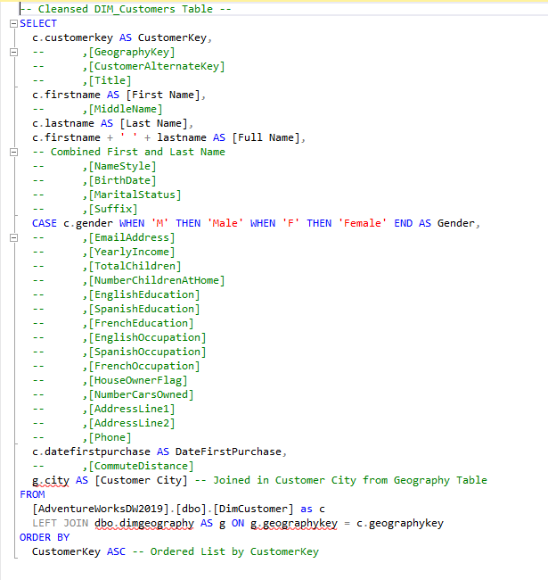

# Data-Analysis-Portfolio

Welcome to my GitHub portfolio showcasing my data analysis project. Explore how I uncover trends and insights in online sales data through data collection, cleaning, analysis, and visualization.

## Data Analyst Project-Sales Management

### Business Request & User Stories

The Business request for this data analysis project was an executive sales report for sales managers. Based on the request from the business the following user stories were defended to fulfill delivery and ensure that acceptance criteria were maintained throughout the project.

### Data Cleansing & Transformation (SQL)

To create the necessary data model for doing analysis and fulfilling the business needs defined in the user stories the following table was extracted using SQL.

One data source (sales budgets) was provided in Excel format and was connected to the data model in a later step of the process.

Before are the SQL statements for cleansing and transforming the necessary data.

**DIM_Calendar:**

**DIM_Customers:**

**DIM_Products:**

**FACT_ InternetSales:**

### Data Model

Below is a screenshot of the data model after the cleansed and prepared table was read into Power BI.

This data model also shows how FACT_Budget has been connected to FACT_InternetSales and other necessary DIM tables.

### Sales Management Dashboard

The finished sales management dashboard with one page works as a dashboard and overview, with two other pages focused on combining tables for necessary details and visualizations to show  sales over time, per customer, and product.

**Click the link to view the dashboard and try it out!**

[[View Dashboard]](Sales Report_Finished.pbix)

